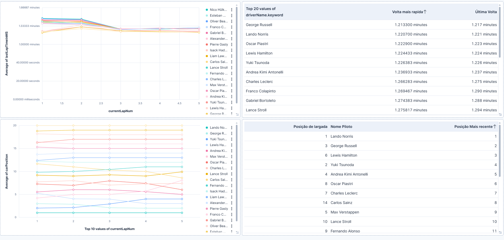
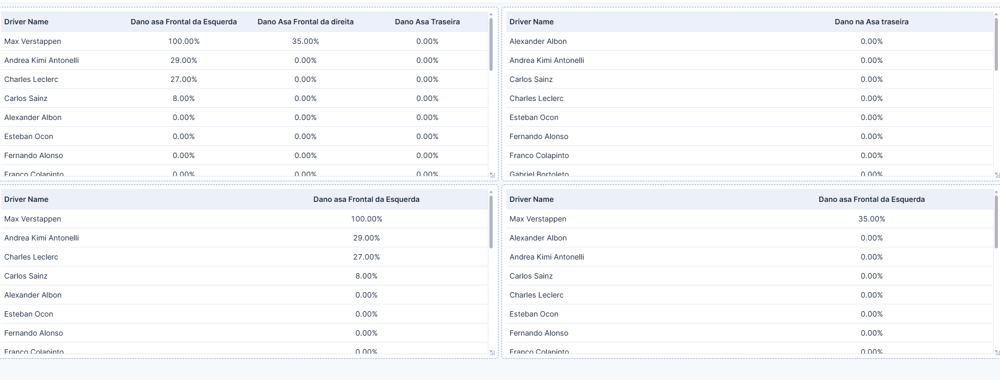
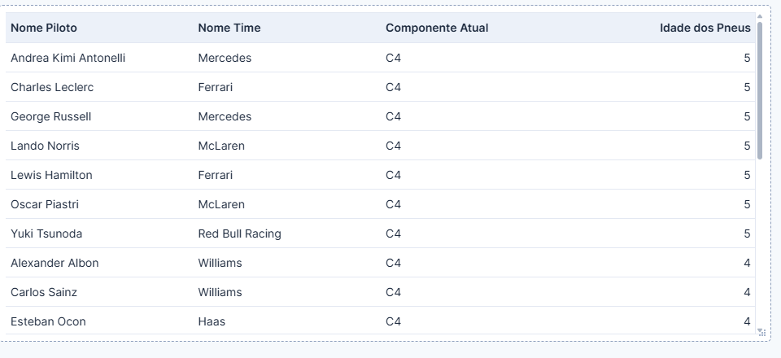
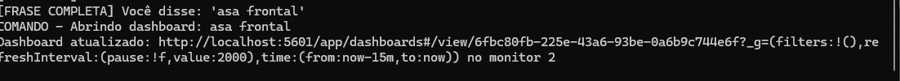
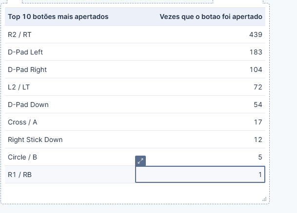

[](https://opensource.org/licenses/MIT)
[](https://dotnet.microsoft.com/)
[](https://www.elastic.co/elasticsearch/)

# 🇺🇸 English Version

# Telemetry-F125-VoiceCommand

## Overview

Telemetry-F125-VoiceCommand is a real-time telemetry system built for **F1 25**, designed to collect, process, and visualize live racing data while the game is running. The system uses **.NET**, **Elasticsearch**, and **Kibana**, combined with a **local voice command worker**, allowing the user to control dashboards without leaving the race.

The main goal of this project is to eliminate the need for Alt+Tab during gameplay, enabling hands-free interaction with telemetry dashboards in real time.

---

## Project Inspiration and Data Source

This project is based entirely on **official telemetry documentation released by EA** for the F1 series.

📄 **Official Telemetry Documentation:**
(https://forums.ea.com/blog/f1-games-game-info-hub-en/ea-sports™-f1®25-udp-specification/12187347)

All packet structures, data formats, and telemetry behavior follow the specifications provided in this documentation.

---

## High-Level Architecture

The system is composed of three main components:

### 1. Telemetry Worker (.NET)

* Listens to the F1 25 **UDP telemetry stream**.
* Parses raw telemetry packets according to EA specifications.
* Normalizes and processes the data.
* Indexes telemetry data into **Elasticsearch** in real time.

This worker is responsible for all game data ingestion and acts as the backbone of the system.

---

### 2. Voice Command Worker (.NET + Vosk)

* Uses **local speech recognition** (Vosk) for offline voice commands.
* Continuously listens for predefined commands while the game is running.
* Triggers actions such as opening or switching **Kibana dashboards**.

This allows full dashboard control without using the keyboard or leaving the game window.

---

### 3. Kibana Dashboards

Kibana serves as the visualization layer for all telemetry data indexed in Elasticsearch. The dashboards provide rich, real-time insights into the race without requiring any interaction with the game window.

- Built directly on top of Elasticsearch indexes for fast querying and aggregation.

- Visualize key telemetry data including lap times and deltas, car status (fuel, ERS, DRS), session information, tire wear and temperatures, brake temperatures, car damage, weather forecasts, and more.
- Designed specifically for display on a second or third monitor, allowing you to keep critical data in view while racing in full-screen mode on your primary monitor.
- Fully customizable — you can create your own visualizations and dashboards tailored to your racing style (e.g., engineer-style tire management, fuel strategy, or damage overview).

Voice commands from the dedicated worker dynamically control which dashboard is displayed or hidden during gameplay. This enables seamless, hands-free switching between views (e.g., checking tire degradation mid-stint or pulling up damage info after contact) without ever needing to Alt+Tab or touch the keyboard/mouse.

**Note on Deployment (Why No Docker Recommended):**  
Although Docker is commonly used for Elasticsearch and Kibana, this project strongly recommends running them natively on Windows (or via direct binaries) rather than inside Docker under WSL. The EA anti-cheat system (used by F1 25) has been observed to conflict with certain WSL/Docker networking and process monitoring behaviors, which can result in false-positive detections and potential game no open(IN MY Case, use Elastic as native Windows services, resolve the crashs). 
---

## Key Features

* Real-time telemetry ingestion from F1 25
* Fully local processing (no cloud dependency)
* Elasticsearch indexing optimized for time-series data
* Voice-controlled dashboard navigation
* Offline speech recognition
* Multi-monitor friendly setup

---

## Getting Started

1. **Enable UDP Telemetry in F1 25**  
   Go to: Settings → Telemetry Settings → UDP Telemetry → On  
   Set UDP Format to **2025** and Port to **20777** (default).

2. **Start Elasticsearch and Kibana**  
   Recommended: Use Elastic and Kibana as native Windows services.
   (Read: Note on Deployment (Why No Docker Recommended) Section for explain.)

3. **Download the Vosk Portuguese Model**  
   Download `vosk-model-small-pt-0.3` from:  
   https://alphacephei.com/vosk/models/vosk-model-small-pt-0.3.zip  
   Extract it and configure the path in `appsettings.json` (VoiceWorker section).

4. **Import or Create Dashboards in Kibana**  
   ```bash
   dotnet build
   dotnet run --project Api-Telemetry-F1
   dotnet run --project F1VoiceDashboardWorker

5. **Build and Run the Workers**  
    Open Kibana at http://localhost:5601 and create visualizations based on the indexed data.
    (I intend to leave the Jetsons-style dashboards already created accessible in the future, so you can simply import them.)
6. Start Racing and Use Voice Commands!

Markdown## Voice Commands (Examples)

| Command (Portuguese)          | Action                                   |
|-------------------------------|------------------------------------------|
| "Abrir dashboard principal"   | Opens the main overview dashboard        |
| "Mostrar voltas"              | Switches to lap times dashboard          |
| "Mostrar pneus"               | Shows tire wear dashboard                |
| "Mostrar danos"               | Displays car damage dashboard            |
| "Mostrar status do carro"     | Opens car status dashboard               |
| "Fechar dashboard"            | Closes the current dashboard             |

You can easily extend the command list in the voice worker code.

---

## Screenshots

  
*Positions overview dashboard in Kibana*

  
*Wing Damage Dashboard*

  
*Tyre Use Dashboard*

  
*Voice command example during a race*

  
*button used Dashboard*

For more Examples, view the folder "screenshots".

## Project Structure

```text
Telemetry-F125-VoiceCommand
│
├── Api-Telemetry-F1/        Core telemetry ingestion and processing
│   ├── Controllers
│   ├── Models
│   ├── Services
│   ├── TelemetryUtils
│   └── Workers
│
├── F1VoiceDashboardWorker/  Voice command worker
│   ├── Models
│   ├── Services
│   ├── Workers
│   └── VoskModel (ignored)
│
├── F1DashboardUI/           # Optional UI / dashboard launcher
│
└── README.md
```

---

## Voice Recognition Model

This project uses **Vosk** for speech recognition.

The Portuguese model (`vosk-model-small-pt-0.3`) is **not included in the repository** and must be downloaded separately.

🔊 **Model download:**
(https://alphacephei.com/vosk/models)
After downloading, place the model in the configured models directory as described in the voice worker configuration.

---

## Configuration

* `appsettings.json` contains shared configuration.
* Local or environment-specific settings should be placed in:

  * `appsettings.Development.json`
  * `appsettings.Local.json`

These files are intentionally ignored by Git.

---

## Requirements

* Windows
* .NET SDK
* Elasticsearch
* Kibana
* Microphone (for voice commands)
* F1 25

---

## Disclaimer

This project is **not affiliated with EA or Codemasters**.

F1 25 telemetry data is used strictly for educational, experimental, and personal purposes, following the official documentation provided by EA.

---

## Future Improvements

* More advanced voice command grammar
* Additional telemetry packet support
* Dashboard auto-layout based on session type
* Performance optimizations for long sessions

---

## License

License

This project is licensed under the MIT License.

The MIT License allows free use, modification, and distribution of this software, provided that the original copyright notice and license text are included.

You are free to use this project for personal, educational, or commercial purposes.

---

# 🇧🇷 Versão em Português (PT-BR)

[](https://opensource.org/licenses/MIT)
[](https://dotnet.microsoft.com/)
[](https://www.elastic.co/elasticsearch/)

# Telemetry-F125-VoiceCommand

## Visão Geral

Telemetry-F125-VoiceCommand é um sistema de telemetria em tempo real construído para **F1 25**, projetado para coletar, processar e visualizar dados de corrida ao vivo enquanto o jogo está sendo executado. O sistema usa **.NET**, **Elasticsearch** e **Kibana**, combinados com um **worker de comandos de voz local**, permitindo que o usuário controle os dashboards sem sair da corrida.

O objetivo principal deste projeto é eliminar a necessidade de Alt+Tab durante o gameplay, possibilitando interação hands-free com os dashboards de telemetria em tempo real.

---

## Inspiração do Projeto e Fonte de Dados

Este projeto é baseado inteiramente na **documentação oficial de telemetria lançada pela EA** para a série F1.

📄 **Documentação Oficial de Telemetria:**
(https://forums.ea.com/blog/f1-games-game-info-hub-en/ea-sports™-f1®25-udp-specification/12187347)

Todas as estruturas de pacotes, formatos de dados e comportamento de telemetria seguem as especificações fornecidas nesta documentação.

---

## Arquitetura de Alto Nível

O sistema é composto por três componentes principais:

### 1. Telemetry Worker (.NET)

* Escuta o **stream de telemetria UDP** do F1 25.
* Analisa os pacotes de telemetria brutos de acordo com as especificações da EA.
* Normaliza e processa os dados.
* Indexa os dados de telemetria no **Elasticsearch** em tempo real.

Este worker é responsável por toda a ingestão de dados do jogo e atua como a espinha dorsal do sistema.

---

### 2. Voice Command Worker (.NET + Vosk)

* Usa **reconhecimento de fala local** (Vosk) para comandos de voz offline.
* Escuta continuamente comandos predefinidos enquanto o jogo está rodando.
* Dispara ações como abrir ou alternar **dashboards do Kibana**.

Isso permite controle total do dashboard sem usar o teclado ou sair da janela do jogo.

---

### 3. Kibana Dashboards

O Kibana serve como a camada de visualização para todos os dados de telemetria indexados no Elasticsearch. Os dashboards fornecem insights ricos e em tempo real sobre a corrida sem exigir qualquer interação com a janela do jogo.

- Construídos diretamente sobre os índices do Elasticsearch para consulta e agregação rápidas.

- Visualize dados chave de telemetria incluindo tempos de volta e deltas, status do carro (combustível, ERS, DRS), informações da sessão, desgaste e temperaturas dos pneus, temperaturas dos freios, danos do carro, previsões climáticas e muito mais.
- Projetados especificamente para exibição em um segundo ou terceiro monitor, permitindo que você mantenha dados críticos à vista enquanto corre em modo tela cheia no seu monitor principal.
- Totalmente customizáveis — você pode criar suas próprias visualizações e dashboards adaptados ao seu estilo de corrida (ex: gerenciamento de pneus estilo engenheiro, estratégia de combustível ou visão geral de danos).

Comandos de voz do worker dedicado controlam dinamicamente qual dashboard é exibido ou oculto durante o gameplay. Isso permite alternância perfeita e hands-free entre visualizações (ex: verificar degradação de pneus no meio do stint ou puxar informações de danos após contato) sem nunca precisar dar Alt+Tab ou tocar no teclado/mouse.

**Nota sobre Implantação (Por Que Docker Não É Recomendado):**  

Embora o Docker seja comumente usado para Elasticsearch e Kibana, este projeto recomenda fortemente executá-los nativamente no Windows (ou via binários diretos) em vez de dentro do Docker sob WSL. O sistema anti-cheat da EA (usado pelo F1 25) foi observado em conflito com certos comportamentos de rede e monitoramento de processos do WSL/Docker, o que pode resultar em detecções de falso-positivo e potencial não abertura do jogo (NO MEU Caso, usar o Elastic como serviços nativos do Windows resolveu os crashes). 
---

## Recursos Principais

* Ingestão de telemetria em tempo real do F1 25
* Processamento totalmente local (sem dependência de cloud)
* Indexação do Elasticsearch otimizada para dados de séries temporais
* Navegação de dashboard controlada por voz
* Reconhecimento de fala offline
* Configuração amigável para múltiplos monitores

---

## Primeiros Passos

1. **Habilite a Telemetria UDP no F1 25**  
   Vá em: Settings → Telemetry Settings → UDP Telemetry → On  
   Defina o UDP Format como **2025** e Port como **20777** (padrão).

2. **Inicie o Elasticsearch e Kibana**  
   Recomendado: Use Elastic e Kibana como serviços nativos do Windows.
   (Leia: Seção Nota sobre Implantação (Por Que Docker Não É Recomendado) para explicação.)

3. **Baixe o Modelo Vosk em Português**  
   Baixe o `vosk-model-small-pt-0.3` de:  
   https://alphacephei.com/vosk/models/vosk-model-small-pt-0.3.zip  
   Extraia-o e configure o caminho em `appsettings.json` (seção VoiceWorker).

4. **Importe ou Crie Dashboards no Kibana**  
   ```bash
   dotnet build
   dotnet run --project Api-Telemetry-F1
   dotnet run --project F1VoiceDashboardWorker

5. **Compile e Execute os Workers**  
    Abra o Kibana em http://localhost:5601 e crie visualizações baseadas nos dados indexados.
    (Pretendo deixar os dashboards estilo Jetsons já criados acessíveis no futuro, para que você possa simplesmente importá-los.)
6. Comece a Correr e Use Comandos de Voz!

## Comandos de Voz (Exemplos)

| Comando (Português)           | Ação                                     |
|-------------------------------|------------------------------------------|
| "Abrir dashboard principal"   | Abre o dashboard de visão geral principal|
| "Mostrar voltas"              | Alterna para o dashboard de tempos de volta|
| "Mostrar pneus"               | Mostra o dashboard de desgaste de pneus  |
| "Mostrar danos"               | Exibe o dashboard de danos do carro      |
| "Mostrar status do carro"     | Abre o dashboard de status do carro      |
| "Fechar dashboard"            | Fecha o dashboard atual                  |

Você pode facilmente estender a lista de comandos no código do voice worker.

---

## Capturas de Tela

  
*Dashboard de visão geral de posições no Kibana*

  
*Dashboard de Danos nas Asas*

  
*Dashboard de Uso de Pneus*

  
*Exemplo de comando de voz durante uma corrida*

  
*Dashboard de botões usados*

Para mais exemplos, veja a pasta "screenshots".

## Estrutura do Projeto

```text
Telemetry-F125-VoiceCommand
│
├── Api-Telemetry-F1/        Ingestão e processamento de telemetria principal
│   ├── Controllers
│   ├── Models
│   ├── Services
│   ├── TelemetryUtils
│   └── Workers
│
├── F1VoiceDashboardWorker/  Worker de comandos de voz
│   ├── Models
│   ├── Services
│   ├── Workers
│   └── VoskModel (ignorado)
│
├── F1DashboardUI/           # UI opcional / lançador de dashboard
│
└── README.md
```

---

## Modelo de Reconhecimento de Voz

Este projeto usa **Vosk** para reconhecimento de fala.

O modelo em português (`vosk-model-small-pt-0.3`) **não está incluído no repositório** e deve ser baixado separadamente.

🔊 **Download do modelo:**
(https://alphacephei.com/vosk/models)
Após o download, coloque o modelo no diretório de modelos configurado conforme descrito na configuração do voice worker.

---

## Configuração

* `appsettings.json` contém a configuração compartilhada.
* Configurações locais ou específicas do ambiente devem ser colocadas em:

  * `appsettings.Development.json`
  * `appsettings.Local.json`

Esses arquivos são intencionalmente ignorados pelo Git.

---

## Requisitos

* Windows
* .NET SDK
* Elasticsearch
* Kibana
* Microfone (para comandos de voz)
* F1 25

---

## Aviso Legal

Este projeto **não é afiliado à EA ou Codemasters**.

Os dados de telemetria do F1 25 são usados estritamente para fins educacionais, experimentais e pessoais, seguindo a documentação oficial fornecida pela EA.

---

## Melhorias Futuras

* Gramática de comandos de voz mais avançada
* Suporte a pacotes de telemetria adicionais
* Layout automático de dashboard baseado no tipo de sessão
* Otimizações de desempenho para sessões longas

---

## Licença

Este projeto é licenciado sob a Licença MIT.

A Licença MIT permite uso, modificação e distribuição gratuitos deste software, desde que o aviso de direitos autorais original e o texto da licença sejam incluídos.

Você é livre para usar este projeto para fins pessoais, educacionais ou comerciais.


